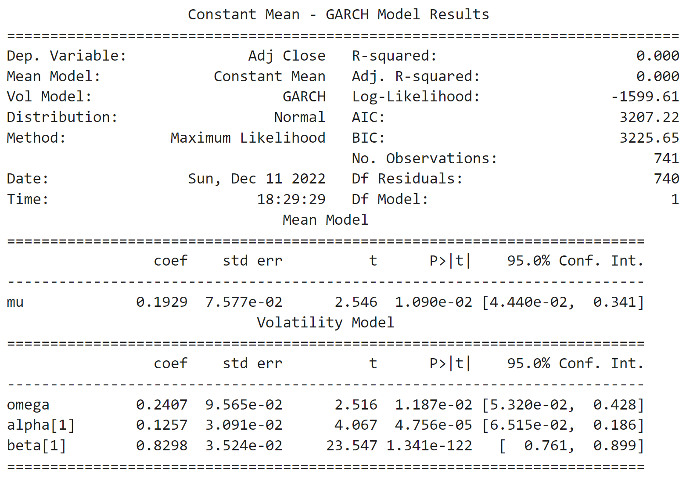
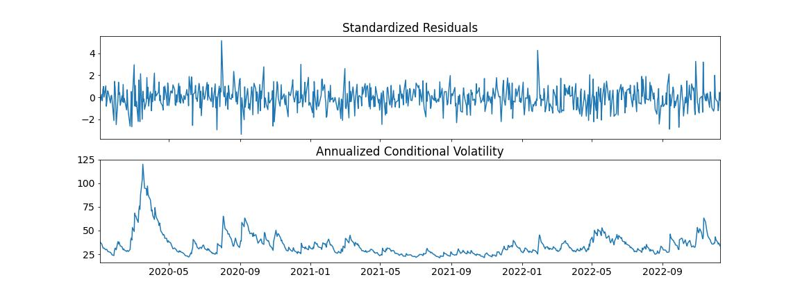

# Find market mispricings like the pros with GARCH
How to forecast volatility with GARCH.

Professional options traders don’t make bets that stocks will go up or down. They look for mispricings in the market. Mispricing happens when the market price is different than what a model says the price should be.

    If the price of an option is $1.50 and the model shows it should be $1.75, a trader would buy the option "cheap" and wait for it to rise to $1.75.

Derivatives models use volatility to determine the value. So quants spend most of their time building the best volatility forecasts they can to find market mispricings. 

### GARCH is widely viewed as a better gauge of volatility than the standard deviation

Stock returns have two interesting features that GARCH models well:

- Variance error terms are autocorrelated (dependent on each other)
- Periods of high volatility tend to cluster

Dr. Tim Bollerslev developed GARCH in 1986 to address the problem of forecasting volatility in asset prices. It’s used in quant finance for risk management, derivatives pricing, and portfolio optimization.

Key Takeaways:

- Get stock price data
- Fit a GARCH model
- Forecast volatility
- Find mispricings

---

Import the libraries:

    matplotlib
    
    numpy
    
    yfinance
    
    arch
    
---

**File:** [GARCH](GARCH.ipynb)

---

## Step 1: Get data

For this example we will grab data for AAPL.

The focus of the dataset will be the benchmark of the adjusted close, we will use the built in pct_change() function and drop any potential null values using the built in .dropna() function as well

---

## Step 2: Fit a GARCH model
Calling arch_model does three things:

- Uses a constant mean

- Assumes a GARCH(1, 0, 1) volatility model

- Uses a normal distribution for the standardized errors

You can adjust these values – and even build your own mean and variance models – as inputs. 

Check out the documentation if you’re interested.
https://arch.readthedocs.io/en/latest/univariate/univariate_volatility_forecasting.html

After the model is defined, fit it.
The ARCH library uses an iterative algorithm called *maximum likelihood estimation* to fit the model parameters. Details of each iteration prints to the screen.

---

## Step 3: Forecast volatility

It shows the statistical significance of each of the coefficients. They all have very small p-values. We can assume the results are not due to random chance.

You can visualize the standardized residuals and conditional volatility.

 

Control the number of forecasts with the horizon argument. The first forecast is used in this example.

- get the variance forecast from the ARCH library returns 
- compute the annualized volatility forecast.
    to convert that to a volatility number, take the sqaure root. Then annualize it.
   
---

## Step 3: Find a mispricing    

Compare the standard deviation of returns to the GARCH volatility forecast. There’s a 10.7% difference. Use an options calculator and value an option using both volatility inputs.

The value of a call option using the GARCH forecast for volatility is $10.12.

The value of a call option using historical volatility is $11.22.

If you believe the GARCH model is more accurate than the historical volatility in forecasting volatility, you’d sell this call option.